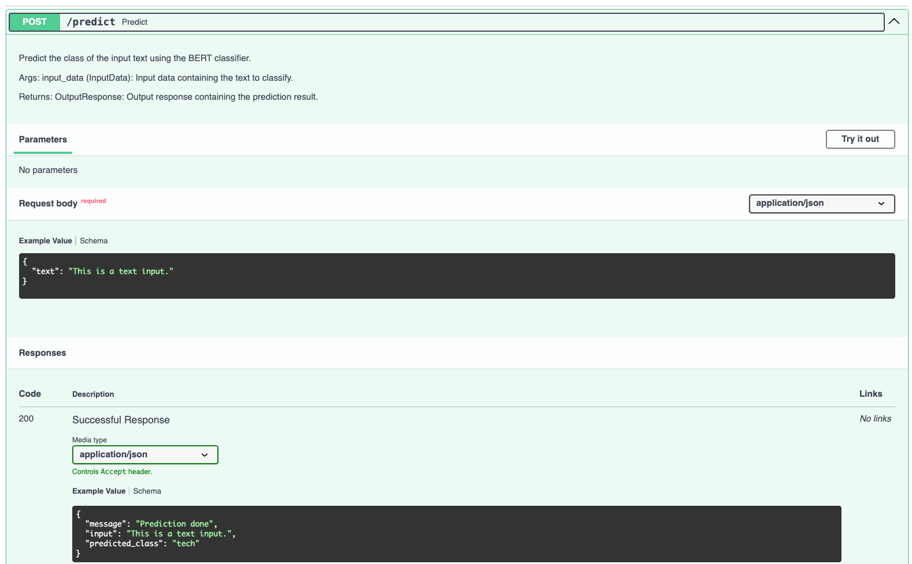
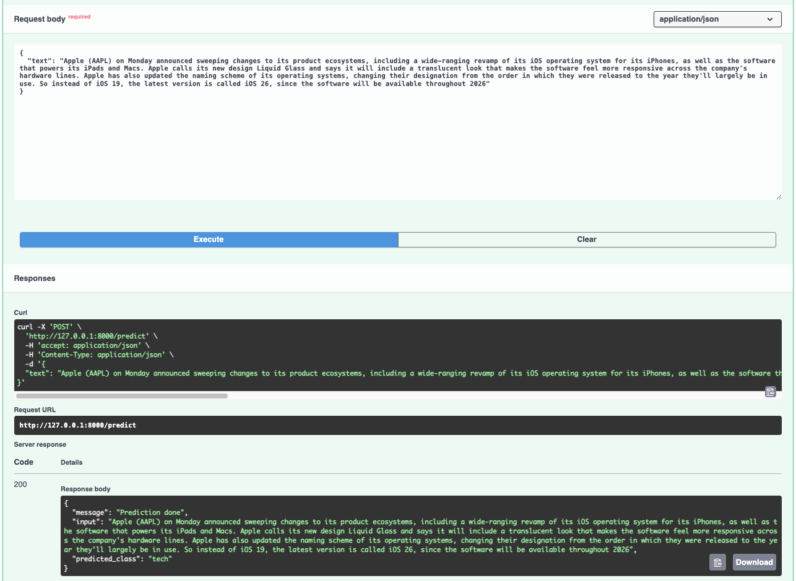

# BERT Text Classification Dockerized API

## Introduction
This project provides a containerized deployment of a fine-tuned BERT model using FastAPI. The model classifies news articles into one of five categories: `business`, `entertainment`, `politics`, `sport`, `tech`.  
The fine-tuning process is detailed in a previous project in the [text-classification](https://github.com/gtsiamit/text-classification) repository.  
This application wraps the model in a RESTful API for easy usage and integrates interactive documentation via FastAPI.

---

## File Structure and Description

```text
bert-api-docker
├─ .dockerignore    # Files and directories ignored during Docker build
├─ .gitignore
├─ Dockerfile    # Instructions to build the Docker container
├─ README.md
├─ bert_api_docker    # Main package directory
│  ├─ __init__.py    # Package initializer
│  ├─ fine_tuned    # Fine-tuned model directory
│  │  ├─ config.json
│  │  ├─ le.pkl
│  │  ├─ model.safetensors
│  │  ├─ special_tokens_map.json
│  │  ├─ tokenizer.json
│  │  ├─ tokenizer_config.json
│  │  ├─ training_args.bin
│  │  └─ vocab.txt
│  ├─ inference.py    # Loads model and handles prediction logic
│  └─ server.py    # FastAPI app and /predict endpoint setup
├─ media
│  ├─ api_example.png    # Example of API usage
│  └─ api_usage.png    # API documentation for usage
└─ requirements.txt    # Python dependencies
```

---

## Project Description

- **Model**: Fine-tuned `bert-base-uncased` model from Hugging Face
- **Input**: News article (`str`)
- **Output**: One of the 5 predefined labels
- **API**: Built using `FastAPI` with `Pydantic` for input/output schema validation
- **Containerization**: Packaged using `Docker` for reproducible deployment
- **Docs**: Auto-generated with FastAPI's Swagger UI

---

## Docker image build and run

The fine-tuned model, the tokenizer, and the label encoder should be stored in the `bert_api_docker/fine_tuned` directory.

The docker image can be built and run with the following commands:
```bash
docker build -t bert-api .
docker run -d -p 8000:8000 bert-api
```

The API can be accessed at `http://127.0.0.1:8000/docs` to view the interactive documentation and test the endpoints.

The API has an endpoint `/predict` that accepts a POST request with a JSON body containing the text to classify. The response will include the predicted label, a message that the request was successful and the text that was passed in the request.  
The predict endpoint can be tested with the `Try it out` button in the interactive documentation.

---

## Prediction Endpoint Overview

Below is shown the expected structure of the input anf output for the `/predict` endpoint. The input/output schemas are defined using Pydantic and automatically rendered in Swagger UI.


Below is an example of an actual request and response from the `/predict` endpoint which was was done for testing interactively via the Swagger UI.

